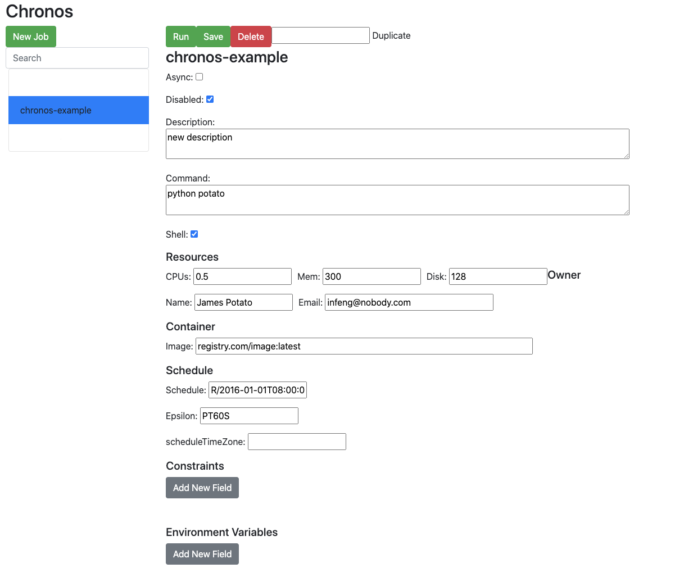

# Create (and Update) a Chronos Job

# Chronos version: 2.5.1

API Information here: <https://github.com/mesos/chronos/blob/2.5.1/docs/docs/api.md>

# Create a new Chronos Job

1.  Ask DevOps to create the base job for you, please provide the name of the job
    1.  `name` : The job name. Must contain at least one character and may only contain letters (\[a-zA-Z\]), digits (\[0-9\]), dashes (-).
2.  Once the job has been created go to the Chronos UI and locate your job (You need to be connected to the environment's VPN)
    1.  http://chronos-ui.service.example.com:8080/
3.  Update the description, command, repeating interval, environment variables and any other setting your job will need to work
    
4.  Uncheck the box next to `Disabled`  if you want your job to be scheduled to run
5.  Click `Save`  and you are done

# Update the Chronos Job Container Image

1.  Update `.circleci/config.yml`  and add a `job`  to your `workflow`  like shown below:

**.circleci/config.yml**

``` yml
usage:
  version: 2.1
  orbs:
    ivybuild: nxtlytics/ivybuild@0.0.1
  workflows:
    version: 2
    build:
      jobs:
        - ivybuild/build_docker_and_deploy:
            deploy_hook_url: https://liftoff.dev.example.com
            deploy_path: chronos
            deploy_task_name: <job-name>
```

# Related Documents

## On ISO 8601 Repeating Intervals

- https://www.digi.com/resources/documentation/digidocs/90001437-13/reference/r_iso_8601_duration_format.htm
- https://stackoverflow.com/questions/7339435/iso-8601-repeating-interval

## Short explanation on each of the Chronos Fields

You can find it in the API documentation under "[Adding a Scheduled Job](https://github.com/mesos/chronos/blob/2.5.1/docs/docs/api.md#adding-a-scheduled-job)"

# DevOps Steps

1.  Update base job template json

**chronos-base-template.json**  Expand source

``` js
{
  "arguments": [],
  "async": false,
  "command": "python potato",
  "constraints": [],
  "container": {
    "forcePullImage": false,
    "image": "registry.com/image:latest",
    "network": "BRIDGE",
    "type": "docker",
    "volumes": []
  },
  "cpus": 0.5,
  "description": "mydesc",
  "disabled": true,
  "disk": 128.0,
  "environmentVariables": [],
  "epsilon": "PT60S",
  "executor": "",
  "highPriority": false,
  "mem": 300.0,
  "name": "<job-name-goes-here>",
  "owner": "infeng@nobody.com",
  "ownerName": "James Potato",
  "retries": 2,
  "runAsUser": "root",
  "schedule": "R/2016-01-01T08:00:00.000Z/PT15M",
  "scheduleTimeZone": "",
  "uris": []
}
```

2.  POST to Chronos scheduler

**POST to Chronos Scheduler**  Expand source

``` bash
curl -L -H 'Content-Type: application/json' -X POST -d @chronos-base-template.json 'http://chronos.service.example.com:4400/scheduler/iso8601'
```
