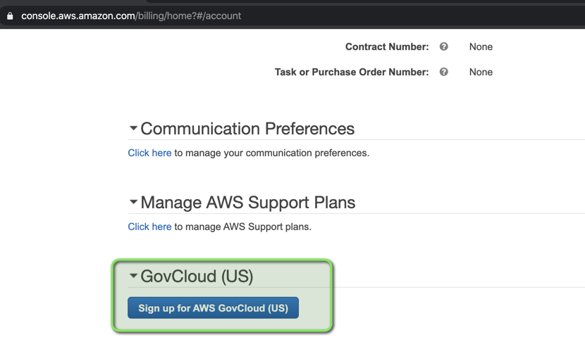

# Creating GovCloud accounts

1.  Create GovCloud account pairing using the root credentials in the Web Console  
    **NOTE:** This step cannot be done via the CLI unless you have IAM credentials for the root user (in this case, you will not have these)  
    **NOTE2:** You MUST be a US citizen to complete this step.
    Completing this step as a non-US citizen probably results in paperwork and general sadness.
    1.  Sign into the commercial account created earlier

    2.  Go to [https://console.aws.amazon.com/billing/home?\#/account](https://console.aws.amazon.com/billing/home#/account)

    3.  Click "Sign up for AWS GovCloud (US)"  
        

    4.  Select the free support plan.  
        - If nothing happens, click it again. You might get redirected
        to the home page. Start over.

    5.  Fill out the scary form

        This may take a while to complete. AWS will send you an email
        once access is approved

2.  Wait until you get an email from AWS, then head to
    <https://portal.aws.amazon.com/billing/signup/web/v1.0/govcloud/signup>
    and complete the signup process

3.  Store the GovCloud Administrator account credentials in your password manager

4.  Create IAM credentials for the GovCloud Administrator account, and
    add them to your **`~/.aws/credentials`** file

5. Clone https://github.com/nxtlytics/ivy-accounts-tools and setup [pipenv](https://pypi.org/project/pipenv/), if you haven't

``` bash
git clone git@github.com:nxtlytics/ivy-accounts-tools.git
```

or

```bash
git clone https://github.com/nxtlytics/ivy-accounts-tools.git
```

6.  Setup account alias, IAM Roles and delete default VPCs

``` bash
AWS_PROFILE=new-gov-account pipenv run python setup_account.py -a ivy-aws-us-gov-something-dev
    -f </path/to/saml/document.xml> -t ivy \
    [-l {CRITICAL,ERROR,WARNING,INFO,DEBUG}]
```

**Example Output:**

```bash
$ AWS_PROFILE=gov-app-dev pipenv run python setup_account.py -a ivy-aws-us-gov-app-dev -s gsuite -t ssa -f ./gsuite_metadata.xml
2020-09-17 19:36:57,046 INFO (MainThread) [botocore.credentials] Found credentials in shared credentials file: ~/.aws/credentials
2020-09-17 19:36:57,232 INFO (MainThread) [root] No E-Mail was provided so I will not create a sub-account
2020-09-17 19:36:57,647 INFO (MainThread) [setup_sso.setup_sso] Did not find an account alias with name ivy-aws-us-gov-app-dev
2020-09-17 19:36:57,958 INFO (MainThread) [setup_sso.setup_sso] I will try to create role with name SSOAdministratorAccess for account ID 111111111111
2020-09-17 19:36:58,137 INFO (MainThread) [setup_sso.setup_sso] I will try to create role with name SSOViewOnlyAccess for account ID 111111111111
2020-09-17 19:36:58,325 INFO (MainThread) [botocore.credentials] Found credentials in shared credentials file: ~/.aws/credentials
2020-09-17 19:36:58,720 INFO (MainThread) [vpc_cleaner.vpc_cleaner] Cleaning AWS region [us-gov-west-1] of all VPCs...
2020-09-17 19:36:59,655 INFO (MainThread) [vpc_cleaner.vpc_cleaner] Cleaning VPC [vpc-11111111] in region [us-gov-west-1]
2020-09-17 19:36:59,684 INFO (MainThread) [vpc_cleaner.vpc_cleaner] Running step [del_igw] for VPC [vpc-11111111] in region [us-gov-west-1]
2020-09-17 19:36:59,998 INFO (MainThread) [vpc_cleaner.vpc_cleaner] Detaching and Removing IGW igw-id: [igw-11111111]
2020-09-17 19:37:00,329 INFO (MainThread) [vpc_cleaner.vpc_cleaner] Running step [del_sub] for VPC [vpc-11111111] in region [us-gov-west-1]
2020-09-17 19:37:00,513 INFO (MainThread) [vpc_cleaner.vpc_cleaner] Removing subnet sub-id: [subnet-11111111]
2020-09-17 19:37:00,788 INFO (MainThread) [vpc_cleaner.vpc_cleaner] Removing subnet sub-id: [subnet-22222222]
2020-09-17 19:37:01,081 INFO (MainThread) [vpc_cleaner.vpc_cleaner] Removing subnet sub-id: [subnet-33333333]
2020-09-17 19:37:01,506 INFO (MainThread) [vpc_cleaner.vpc_cleaner] Running step [del_rtb] for VPC [vpc-11111111] in region [us-gov-west-1]
2020-09-17 19:37:01,697 WARNING (MainThread) [vpc_cleaner.vpc_cleaner] Deleting route table: rtb-11111111 is the main route table, continue...
2020-09-17 19:37:01,697 INFO (MainThread) [vpc_cleaner.vpc_cleaner] Running step [del_acl] for VPC [vpc-11111111] in region [us-gov-west-1]
2020-09-17 19:37:01,802 WARNING (MainThread) [vpc_cleaner.vpc_cleaner] Deleting NACL: acl-11111111 is the default NACL, continue...
2020-09-17 19:37:01,802 INFO (MainThread) [vpc_cleaner.vpc_cleaner] Running step [del_sgp] for VPC [vpc-11111111] in region [us-gov-west-1]
2020-09-17 19:37:01,990 WARNING (MainThread) [vpc_cleaner.vpc_cleaner] Deleting security group: sg-11111111 is the default security group, continue...
2020-09-17 19:37:01,990 INFO (MainThread) [vpc_cleaner.vpc_cleaner] Running step [del_vpc] for VPC [vpc-11111111] in region [us-gov-west-1]
2020-09-17 19:37:01,990 INFO (MainThread) [vpc_cleaner.vpc_cleaner] Removing vpc-id: [vpc-11111111]
2020-09-17 19:37:02,412 INFO (MainThread) [vpc_cleaner.vpc_cleaner] Cleaning AWS region [us-gov-east-1] of all VPCs...
```

7.  Add the SSO role to users in G Suite

    1.  Open G Suite Admin

    2.  Users -\> select user to edit -\> User Information -\> **AWS
        SSO**

    3.  Add
        `arn:aws-us-gov:iam::<new account id>:role/SSOAdministratorAccess,arn:aws-us-gov:iam::<new account id>:saml-provider/ivy-gsuite`
        or `arn:aws-us-gov:iam::<new account id>:role/SSOViewOnlyAccess,arn:aws-us-gov:iam::<new account id>:saml-provider/ivy-gsuite`
        (accordingly)

    4.  Ensure duration is set to **28800**

    5.  Rinse and repeat for all users that require access to new
        account

8.  Configure local SAML credentials for the GovCloud account. Add the following to your **`~/.saml2aws`** configuration file

``` text
[<new account name>]
app_id               = <URL from G Suite's SAML>
url                  = 
username             = <you>@example.com
provider             = GoogleApps
mfa                  = Auto
skip_verify          = false
timeout              = 0
aws_urn              = urn:amazon:webservices
aws_session_duration = 28800
aws_profile          = <new account name>
resource_id          =
subdomain            =
role_arn             = arn:aws-us-gov:iam::<new account id>:role/SSOAdministratorAccess
region               = us-gov-west-1
```

    Notice the SPid is different from Commercial AWS!

9. Remove IAM credentials for the GovCloud Administrator account

10. Invite the new account to the AWS GovCloud organization (you need to
    login to `ivy-aws-us-gov-west-1-master-prod`  and send the invite to
    \<new account id\>)

11. You can now start setting up [ivy in this environment](./Creating_new_ivy_environment.md)
