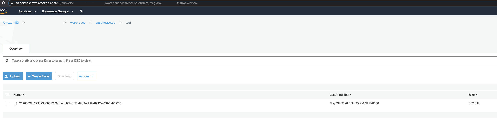

# Presto and Hive

# Overview

Here you will find the basics on how to work with Presto SQL Engine and Hive Metastore

# Create a new Hive Database

Ask DevOps to create it for you

# How to work with Presto and Hive

**Note:** Presto documentation can be found [here](index) and Presto/Hive specific documentation can be found [here](https://prestosql.io/docs/current/connector/hive.html).

1.  Download the presto client. At this moment we are using version
    [333](https://repo1.maven.org/maven2/io/prestosql/presto-cli/333/presto-cli-333-executable.jar)

2.  Connect to to the presto master

    **Connect to presto server running in dev**

    ``` bash
    java -jar presto-cli-333-executable.jar --server presto.service.dev.example.com:5111 --catalog hive
    ```

3.  Specify to use your new database

    **Example: Use database**

    ``` sql
    presto> use hive.<database name here>;
    USE
    ```

4.  Create table

    **Example: Create table**

    ``` sql
    presto:dbname> CREATE TABLE test ( id int, comment varchar );
    CREATE TABLE
    presto:dbname>
    ```

5.  Insert values and confirm you can see them

    **Example: Insert and select values**

    ``` sql
    presto:dbname> INSERT INTO test VALUES (1, 'hi'), (2, 'hello');
    INSERT: 2 rows

    Query 20200528_223423_00012_2apyz, FINISHED, 2 nodes
    Splits: 35 total, 35 done (100.00%)
    0:02 [0 rows, 0B] [0 rows/s, 0B/s]

    presto:dbname> select * FROM test;
     id | comment
    ----+---------
      1 | hi
      2 | hello
    (2 rows)

    Query 20200528_223435_00013_2apyz, FINISHED, 1 node
    Splits: 17 total, 17 done (100.00%)
    0:00 [2 rows, 362B] [5 rows/s, 1KB/s]
    ```

## Bonus: How does an orc file look like?

First download the file. Example: Database name: `warehouse`  Table name: `test`  using s3 web console:



**file header and content**

``` bash
$ file 20200528_223423_00012_2apyz_d91adf31-f7d2-489b-8912-e43b0a96f010
20200528_223423_00012_2apyz_d91adf31-f7d2-489b-8912-e43b0a96f010: Apache ORC
$ strings 20200528_223423_00012_2apyz_d91adf31-f7d2-489b-8912-e43b0a96f010
ORC'
&%^.
hihellod
hello
aT'M|
&M/TNV

((0
```

# DevOps steps

1.  ssh to hive-metastore

2.  Attach to docker container running hive

3.  Execute the hive script

4.  Create the database specifying s3 as the location for it


**Create Database Walkthrough**

``` bash
$ ssh hive-metastore.service.dev.example.com
$ sudo su -
# docker exec -it $(docker ps | grep 'hive-metastore' | awk '{ print $1 }') bash 
# /opt/hive/latest/bin/hive
SLF4J: Class path contains multiple SLF4J bindings.
SLF4J: Found binding in [jar:file:/opt/hive/apache-hive-3.1.2-bin/lib/log4j-slf4j-impl-2.10.0.jar!/org/slf4j/impl/StaticLoggerBinder.class]
SLF4J: Found binding in [jar:file:/opt/hadoop/hadoop-3.2.1/share/hadoop/common/lib/slf4j-log4j12-1.7.25.jar!/org/slf4j/impl/StaticLoggerBinder.class]
SLF4J: See http://www.slf4j.org/codes.html#multiple_bindings for an explanation.
SLF4J: Actual binding is of type [org.apache.logging.slf4j.Log4jLoggerFactory]
Hive Session ID = 73df39c5-59cf-4e50-a9ab-e59d0c8a7d2d

Logging initialized using configuration in jar:file:/opt/hive/apache-hive-3.1.2-bin/lib/hive-common-3.1.2.jar!/hive-log4j2.properties Async: true
Hive Session ID = 3b53799b-4b68-4ef9-b2a6-a2383e214296
Hive-on-MR is deprecated in Hive 2 and may not be available in the future versions. Consider using a different execution engine (i.e. spark, tez) or using Hive 1.X releases.
hive> create database <database name here> location 's3a://<bucket name>/warehouse/<database name here>.db';
OK
Time taken: 2.67 seconds
hive> exit;
#
```
